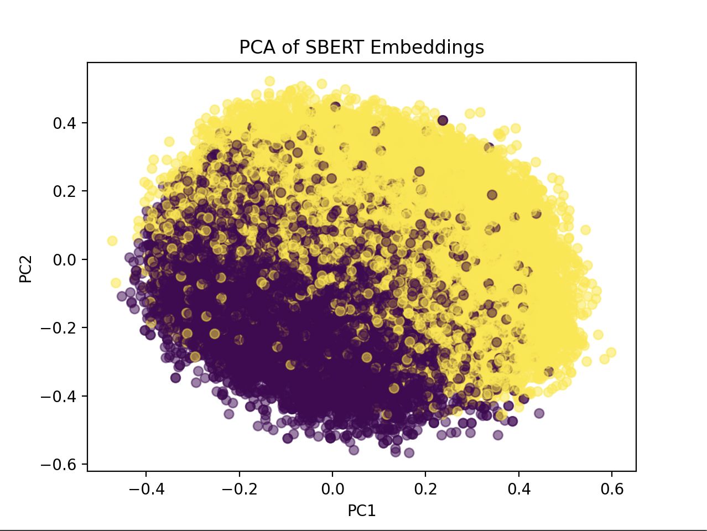

# Fake News Detection Using SBERT and Supervised Learning

Author: Justin Lee  
Course: CS 406 - Projects  
Date: 2/11/2026

# 1. Introduction

## 1.1 Problem Statement

With our growing reliance on the internet in our day-to-day lives, it is increasingly important that the information we consume is accurate. This need is accentuated by the rapid growth in strength and usage of generative AI creating “slop” news articles that are neither truthful nor relevant simply to farm clicks. As someone who is regularly sent fake news by family members, I aim to reduce the credibility of these articles by building a detection pipeline that classifies articles as true or fake.

## 1.2 High-Level Overview

Since the detection pipeline will operate with articles, we need a meaningful way to process the natural language input before providing it to the classification model. To achieve this, article input will be preprocessed by an SBERT model to produce fixed-sized embeddings to represent the article, which will be used to train the classification model.

**Detection pipeline:**

Article input → SBERT → Vector embeddings → Classification model → Prediction/Confidence

The end goal is to host this pipeline on a webpage where a user may input a link to an article and receive a prediction and confidence score.

---

# 2. Dataset Selection and Justification

## 2.1 Dataset Description

This project will utilize the Kaggle Fake and Real News Dataset for training the classification model, which contains two CSV files:

- **Fake.csv** – containing fake news articles  
- **True.csv** – containing real news articles  

Each dataset contains the following columns:

- Title  
- Text  
- Subject  
- Date  

This dataset is structured for a binary classification task, where each article is labeled as either fake or real. The full article text is included in the `text` column, which is essential for generating meaningful semantic embeddings using SBERT.

## 2.2 Dataset Justification

In addition to the structure of the dataset matching the goals of this project, this dataset was selected due to it being publicly available and widely used. It is distributed under the Creative Commons CC BY-NC-SA 4.0 License, making it free to use for academic and non-commercial purposes. The dataset contains a sufficient volume of datapoints, allowing for the freedom of choosing more complex models as the classification component.

## 2.3 Dataset Limitations

This dataset mostly contains articles pertaining to political news and as such may not generalize well to all domains. Additionally, this dataset was last updated two years ago and will not contain any recent articles.

---

# 3. Statement of Methods

## 3.1 Data Preprocessing

The end goal for this project will be to scrape articles for classification. Because of this, the subject may not be accessible from every input article. Therefore, the data used to train the classification model excludes the `subject` feature to ensure consistency between training data and real-world inputs. The `date` feature was also excluded, as publication date does not inherently indicate the credibility of the article and may introduce temporal bias.

Using the `pandas` library, the two datasets are loaded and combined into one dataframe. A new `content` column is added, populated with the title followed by the article text. The dataframe is then trimmed of the unnecessary columns, leaving just `content` and `label`. The `train_test_split` function from the `scikit-learn` library is used to split the dataset into:

- A training dataset containing 80% of the datapoints  
- A test dataset containing the remaining 20% of the datapoints  

## 3.2 Embedding Generation with SBERT

The `all-MiniLM-L6-v2` model is used for generating the semantic embeddings. This model was selected due to its ability to capture the semantic meaning of sentences and short paragraphs and represent the input as a 384-dimensional vector.

Each datapoint in the train and test datasets is encoded into embeddings by this model to be used in classifier training.

## 3.3 Classifier Training

Based on these embeddings, two classifiers are trained and analyzed against each other. The classifier with the highest test accuracy will be selected for the final pipeline.

### 3.3.1 Logistic Regression

The simpler of the two, logistic regression learns a linear decision boundary in the embedding space to divide the two classes (fake and real). This model assumes that class separation can be approximated linearly and may perform worse when the data violates this assumption.

### 3.3.2 Neural Network

A shallow fully connected neural network learns a piecewise decision boundary with each segment’s shape influenced by the activation function. The network implemented for this project utilizes the Rectified Linear Unit (ReLU) activation function, creating a piecewise linear decision boundary. While each segment is locally linear, stacking neurons and layers enables the network to learn arbitrarily complex decision boundaries. The motivation behind using a neural network is fueled by this introduction of more complex decision boundaries, which may perform above logistic regression in the case that the data is not linearly separable.

---

# 4. Exploratory Data Analysis

## 4.1 Dimensionality Reduction of SBERT Embeddings

Since SBERT produces 384-dimensional vectors, we cannot easily plot the datasets and determine if the data is linearly separable.

Principal Component Analysis (PCA) is an algorithm that finds the directions where the dataset has the most variance, called the principal components, and projects the data onto those lines. This reduces the dimensions of the data while preserving as much information as possible.

The plot produced by performing PCA on the SBERT embeddings is shown below.

Analyzing this plot, we find that the data is heavily overlapping but is also visibly structured, with the yellow class dominating the upper-right region and the purple class dominating the lower-left region.

The plot suggests a gradient separation along a diagonal axis, indicating that the principal components depicted retain variance correlated with class. While the 2D projection shows significant overlap between classes, PCA only preserves directions of maximum variance and may lose information regarding class separability. Considering this fact, overlap in the 2D projection does not directly imply that the data is linearly inseparable in the original high-dimensional space.
